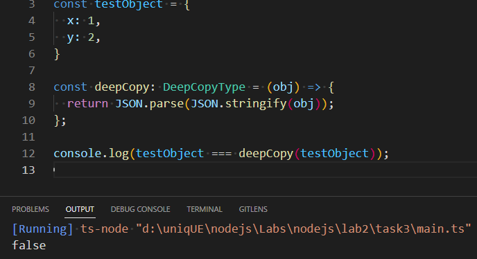

## ПРИМІТКИ
Для того, щоб функція `deepCopy` робити глибоку копію любого об'єкт, було використано дженерик, який допоможе зробити функцію більш загальною.

Також можна було використати `Record<string, unknown>`, який описує загальний тип об'єкта, але на мою думку варіант з дженериками виглядає краще.

## ПОЯСНЕННЯ
Було створено тип `DeepCopyType`, який типізує функцію `deepCopy`.

## Результат виклику функції
;