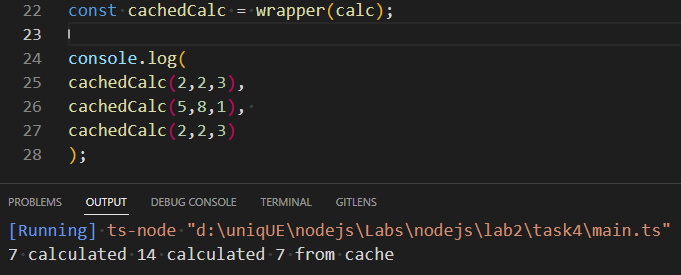

## ПРИМІТКИ
Тип `WrappedFunction` повертає `unknown`, тому що в задачі не було конкретизовано, що саме повинна повертати функція, яку ми передаємо в нашу обгортку.

Відповідно структура данних `Map` буде зберігати данні у вигляді `<string, unknown>`.

## ПОЯСНЕННЯ
Було створено два типи `WrappedFunction` та `WrapperType`. 

Перший типізує функцію, яку ми передаємо в  `wrapper`, а другий саму функцію `wrapper`.

Інші змінні вирішив не типізувати, тому що вважаю, що це нагромадить код. До того ж TS сам розуміє, що в них повинно зберігатись, по значенню яке було присвоєно.

## Результат виклику функції
;