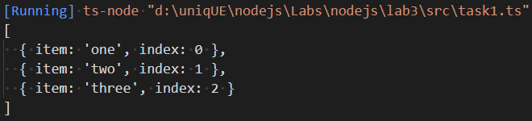
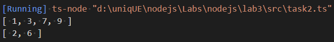
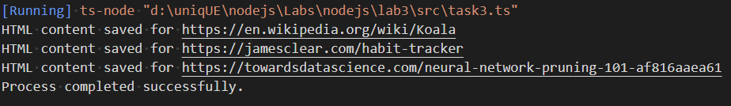
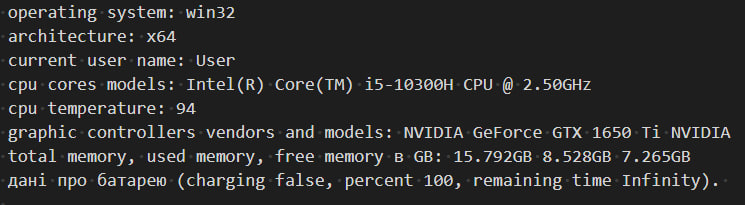
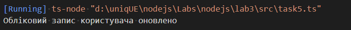

# Лабораторна номер 3
# Завдання 1
Маємо функцію, яка приймає масив невідомих елементів та АСИНХРОННУ функцію та повертає нам массив результатів виклику колбека.
Створюємо функцію асинхронну функцію **resultsArray**  всередині якої використовуємо ключове слово **await**, щоб можна було 'дочекатись' виконання фукнції повернути потім всі resolve проміси.

# Завдання 2
Фактично це є релізації метода filter, але з двома ключовими відмінностями:
- Наш метод є м'ютабельним
- Наш метод повертає видалені елементи (тобто ті, що не пройшли фільтрацію)

Завдання та реалізація максимально проста, тому розписувати дуже детально не буду.

# Завдання 3
Взагалому все це завдання можна поділити на наступні кроки
1. Зчитуємо JSON-файл за вказаним шляхом за допомогою **fs.readFileSync**. Отриманий JSON-об'єкт зберігається у змінній **jsonData**.

2. Визначаємо ім'я JSON-файлу за допомогою path.basename та зберігає його у змінну **jsonFilename**.

3. Створює вихідну папку **outputFolder** з назвою <jsonFilename>_pages, якщо вона ще не існує, за допомогою **fs.existsSync** та **fs.mkdirSync**.

4. Для кожного URL, прочитаного з **jsonData**, виконується наступне:

a. Викликається функція fetchHTMLContent, яка приймає URL як аргумент та повертає HTML-контент у вигляді рядка. Ця функція використовує внутрішню функцію fetch для виконання запиту GET до вказаного URL та отримання відповіді. Отриманий HTML-контент зберігається у змінну htmlContent.

b. Створюється назва файлу (filename) для зберігання HTML-контенту. У даному випадку, виконується заміна всіх символів, що не є латинськими буквами або цифрами, на символ підкреслення (_). Це зроблено за допомогою регулярного виразу /[^a-zA-Z0-9]/g. Також, додається розширення .html.

c. Визначається повний шлях до файлу (filePath) за допомогою path.join, об'єднуючи шлях до вихідної папки та назву файлу.

d. Записується HTML-контент у файл за допомогою fs.writeFileSync.

e. Виводиться повідомлення у консоль про успішне збереження HTML-контенту для даного URL.

Виводиться повідомлення у консоль про успішне завершення процесу.

# Завдання 4
Використовуємо пакети **os**, **systeminformation**, щоб отримати інформацію про систему та **readline**, щоб надати користувачу взаємодію з командним рядком.

Після цього створив метод **getInfo**, всередині якого отримуємо дані про нашу систему, а також робимо цей метод асинхронним, адже багато методів з пакетів, які ми встановили є асинхронними, тому нам потрібно ключове слово **await**

Використовуючи пакет **readline** надаємо можливість користувачу вводити дані, потім їх опрацьовуємо та передаємо у інтервал, який викликає метод **getInfo** через певну кількість мс.

### Відповідно таке повідомлення ми будемо отримату вказану кількість мілісекунд.

# Завдання 5
Клас MyEventEmitter містить приватне поле eventHandlers, яке є об'єктом, що використовується для зберігання обробників подій. Кожна подія представлена як ключ об'єкта eventHandlers, і пов'язані з нею значеннями є масиви обробників, які слухають цю подію.

Метод registerHandler використовується для реєстрації нового обробника для певної події. Він приймає назву event'у і його handler. Якщо для даної події ще не існує жодного обробника, створюється новий масив обробників для цієї події. Потім переданий обробник додається до масиву обробників для відповідної події.

Метод emitEvent використовується для випуску події. Він приймає назву event'у. Перевіряється, чи є в eventHandlers масив обробників для даної події. Якщо такий масив існує, проходиться по кожному обробнику і викликається відповідна функція обробника.

