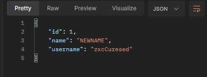

# Лабораторна №4
1. Перед початком роботи я скачав пакети для роботи з **Express**, **TypeScript**, **Dotenv** та **Nodemon**.
2. Виніс потрібні значення в змінні оточення та додав файли, які необхідні лише на етапі розробки, до **.gitignore**.
3. В папці **types** окремо винесені типи. Інтерфейс **User**, який описує однойменну сутність та **Enum ErrorTypes**, який визначає тип помилок, які можуть виникнути в програмі.
4. В файлі **index.ts** реалізовано головне завдання лабораторної.

# Результати роботи:
# ВИКОНАННЯ PUT МЕТОДА

# ВИКОНАННЯ POST МЕТОДА

# ВИКОНАННЯ GET МЕТОДА

# ВИКОНАННЯ DELETE МЕТОДА
.jpg)
.jpg)
